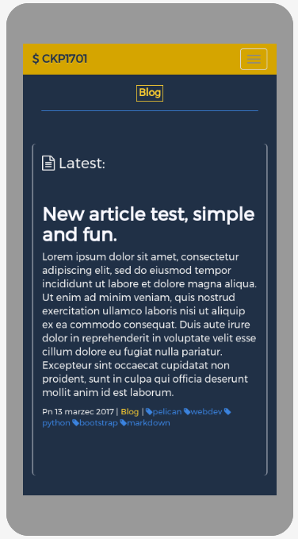
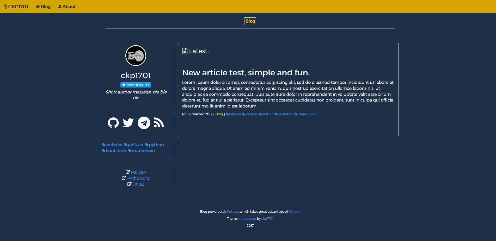
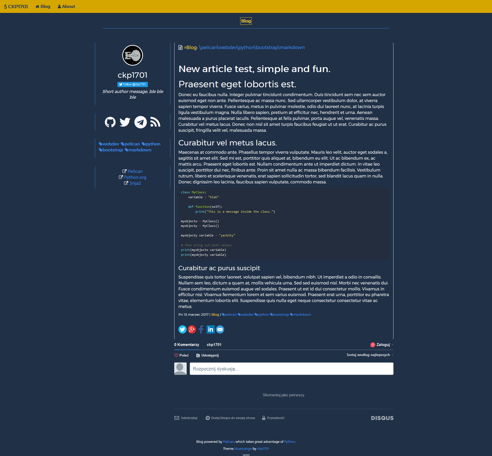
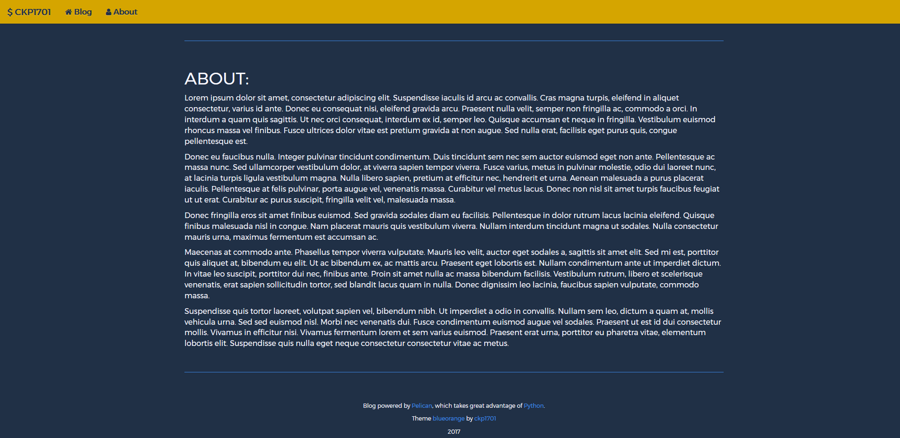

# pelican-blueorange

Responsive theme for [Pelican - static blog generator](http://blog.getpelican.com/)

For more detailed information look into [Quickstart](http://docs.getpelican.com/en/stable/quickstart.html) and [Pelican Docs](http://docs.getpelican.com/en/stable/)

## Demo

Live preview on https://ckp1701.github.io

## Screenshots







## Features

* Responsive
* Syntax highlight with pygments
* Disqus 
* Google Analitics
* RSS/ATOM
* Easy to install 


## Installation

* Clone or download manualy pelican-uglyblue repository.

```
$ git clone https://github.com/ckp1701/pelican-uglyblue.git
```

* Create 'THEME' variable in your 'pelicanconf.py'settings with path to your theme.

Example:

```python
THEME = 'pelican-themes\pelican-uglyblue'
```

## Settings

### Add folowing code to your 'pelicanconf.py'

* Social icons

```python
SOCIAL = (('linkedin', 'https://www.linkedin.com/in/username'),
          ('github', 'https://github.com/username'),
          ('twitter', 'https://twitter.com/username'),
          ('facebook', 'https://www.facebook.com/username'),
          )
```

* Author message
```python
AUTHOR_MESSAGE = 'Hello World!'
```

* Running local server for development

comment/uncoment 'SITEURL' for localhost settings

```python
SITEURL = 'http://localhost:8000'
#SITEURL = 'https://yoursite.github.io'
```

and launch local server from your /output/ directory

```
$ python -m http.server
```

* Favicon

```python
FAVICON = 'url-to-favicon'
```

* Show pages on navbar menu
```python
DISPLAY_PAGES_ON_MENU = True
```

* Disqus and Google Analytics integration

```python
DISQUS_SITENAME = "username"
GOOGLE_ANALYTICS = "username"
```

* Feeds
```python
FEED_ALL_ATOM = 'feeds/all.atom.xml'
CATEGORY_FEED_ATOM = 'feeds/%s.atom.xml'
```

### This is example of my pelicanconf.py settings

```python
#!/usr/bin/env python
# -*- coding: utf-8 -*- #
from __future__ import unicode_literals

AUTHOR = 'ckp'
SITENAME = 'ckp1701'

#comment/uncomment for development mode
#SITEURL = 'http://localhost:8000'
SITEURL = 'https://ckp1701.github.io'

PATH = 'content'

TIMEZONE = 'Europe/Paris'

DEFAULT_LANG = 'pl'

# Feed generation is usually not desired when developing
FEED_ALL_ATOM = 'feeds/all.atom.xml'
CATEGORY_FEED_ATOM = 'feeds/%s.atom.xml'
TRANSLATION_FEED_ATOM = None
AUTHOR_FEED_ATOM = None
AUTHOR_FEED_RSS = None

# Blogroll
LINKS = (('Pelican', 'http://getpelican.com/'),
         ('Python.org', 'http://python.org/'),
         ('Jinja2', 'http://jinja.pocoo.org/'),
         )

# Social widget
SOCIAL = (('github', 'https://github.com/ckp1701'),
    ('twitter', 'https://github.com/ckp1701'),
    ('telegram', 'https://t.me/ckp1701'),
         )

#Main manu links
MENUITEMS = (('Blog', SITEURL),
)


#DISPLAY ELEMENTS SETTING
BOTS_STATS = False
DISPLAY_PAGES_ON_MENU = True
DISPLAY_TAGS_ON_MENU = True
DISPLAY_CATEGORIES_ON_MENU = True
DISPLAY_SUMMARY = True
DISPLAY_AUTHOR_MESSAGE = True
PAGES = True
DISQUS_SITENAME = "CKP1701"
FAVICON = 'https://avatars0.githubusercontent.com/u/14226241?v=3&s=460'


#set short message
AUTHOR_MESSAGE = 'Short author message, ble ble ble'


#Other settings
DEFAULT_PAGINATION = 2
THEME = 'pelican-themes/pelican-blueorange'
GOOGLE_ANALYTICS ='UA-91848473-1'
SITE_DESCRIPTION = "Programowanie, python, inżynieria i pokrewne."
TWITTER_USERNAME = 'ckp1701'
AVATAR = "https://avatars0.githubusercontent.com/u/14226241?v=3&s=460"
```